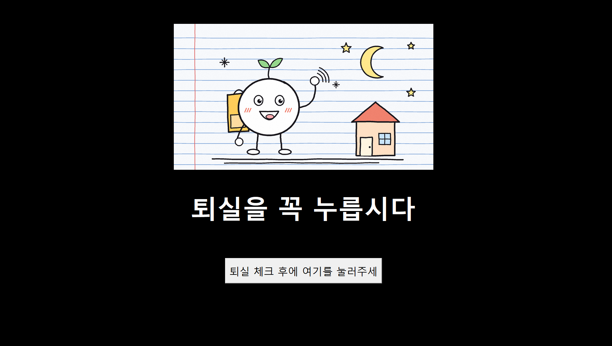
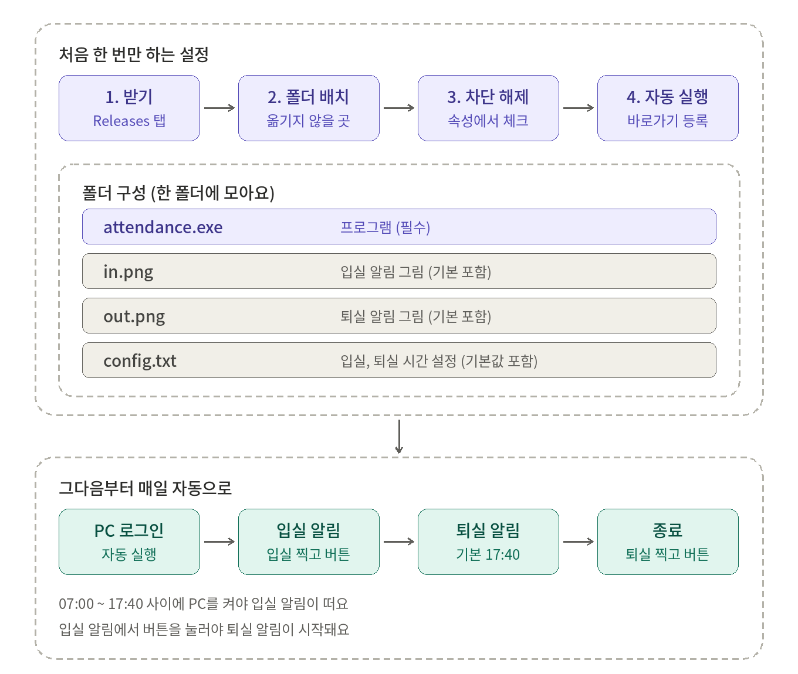

# 출결눌러요 ⏰

국비 교육 **입실 / 퇴실 출결 깜빡 방지** 프로그램이에요.
PC를 켜면 전체화면으로, 퇴실 시간이 되면 또 한 번, 출결을 누르라고 알려줘요.

## 📸 이렇게 떠요

### 1️⃣ PC를 켰을 때 (입실)


폰 출결 앱에서 입실을 찍고 **[출결 체크 완료]** 버튼을 누르면 창이 사라져요.

### 2️⃣ 퇴실 시간이 되면 (기본 17:40)



폰 출결 앱에서 퇴실을 찍고 버튼을 누르면 마지막 인사가 나와요.


1초 뒤 프로그램이 종료돼요.

> 💡 그림은 기본으로 들어 있는 `in.png`, `out.png` 예요. 마음에 드는 그림으로 **바꿀 수 있어요.** (아래 **알림 그림 바꾸기** 참고)

## ✨ 한눈에 보기

| PC를 켠 시각 | 동작 |
|---|---|
| 07:00 ~ 퇴실 시간 | 입실 알림 → (버튼 클릭) → 퇴실 시간에 퇴실 알림 |
| 07:00 이전 / 퇴실 시간 이후 | 아무것도 안 뜸 |

> ⚠️ **입실 알림에서 버튼을 눌러야** 퇴실 알림이 시작돼요.
> 전체화면이 안 닫힐 때는 `Alt + F4`

## 🗺️ 처음부터 사용까지



## 📥 받기

1. 이 저장소의 **Releases** 에서 **`attendance-reminder-v1.0.0.zip`** 하나만 내려받아요
   (`attendance.exe`, `config.txt`, `in.png`, `out.png` 가 모두 들어 있어요)
2. **차단 해제**를 해요 (아래 참고, 압축을 풀기 **전에**)
3. zip을 풀어서 폴더를 **옮기지 않을 곳**에 둬요 (예: `C:\출결눌러요`)
4. `attendance.exe` 를 더블클릭해요

### 🔓 차단 해제 (한 번만)

인터넷으로 받은 파일은 Windows가 "다른 컴퓨터에서 온 파일"로 표시해서, 실행할 때마다 **"열기 전에 항상 확인"** 팝업이 뜰 수 있어요.
자동 실행에 쓰려면 미리 풀어두세요.

1. 내려받은 **zip 파일** 우클릭 → **속성**
2. **일반** 탭 맨 아래 **보안** 칸의 **`차단 해제`** 에 체크
3. **확인** → 그다음에 압축을 풀어요

> 💡 zip에서 먼저 풀어두면, 압축을 푼 파일들에는 표시가 붙지 않아요.
> 이미 압축을 풀었다면 `attendance.exe` 우클릭 → **속성** 에서 같은 방법으로 풀어요.
> `차단 해제` 가 안 보이면 이미 해제된 거예요.

### 파란 "Windows의 PC 보호" 창이 뜰 때

**추가 정보 → 실행** 을 누르면 돼요. (직접 만든 개인 프로그램이라 뜨는 안내예요)
회사나 학원 PC에서 계속 막히면 **관리자(전산팀)** 에게 문의하세요.

## 📁 폴더 구성

```
출결눌러요 폴더
├─ attendance.exe     ← 프로그램
├─ in.png             ← 입실 알림에 뜨는 그림 (기본 그림이 들어 있어요)
├─ out.png            ← 퇴실 알림에 뜨는 그림 (기본 그림이 들어 있어요)
└─ config.txt         ← 시간 설정 (기본값이 적혀 있어요. 바꾸고 싶을 때만 열어요)
```

## 🖼️ 알림 그림 바꾸기

`in.png`, `out.png` 는 **기본 그림**이에요. 그냥 쓰셔도 되고, 바꾸고 싶으면 **같은 이름의 파일로 덮어쓰세요.**

> ## ⚠️ 파일 이름을 반드시 아래처럼 맞춰야 해요!
> 이름이 다르면 그림이 **뜨지 않아요.**

| 그림이 뜨는 화면 | 파일 이름 |
|---|---|
| 입실 알림 (PC 켰을 때) | **`in`** |
| 퇴실 알림 + 마지막 인사 | **`out`** |

**확장자는 아래 4가지 중에서 쓰는 것을 권장해요.**

`png` · `jpg` · `jpeg` · `webp`

예) `in.png`, `out.jpg`

**꼭 확인하세요**

- 이름은 **영어 소문자** `in`, `out` 그대로 (한글, 대문자, 번호 붙이기 ❌)
- 프로그램(`attendance.exe`)과 **같은 폴더**에 넣기
- `in.png.png` 처럼 확장자가 **두 번** 붙지 않게 주의
  - 확장자가 안 보이면 폴더 위쪽 **보기 → 표시 → 파일 확장명** 체크
- 그림 파일을 지워도 괜찮아요 (그림 없이 문구와 버튼만 떠요)
- 가로로 긴 사진이 잘 어울려요 (비율은 그대로 유지돼요)

## ▶️ PC 켤 때마다 자동으로 실행하기

1. `attendance.exe` 우클릭 → **바로가기 만들기**
2. 키보드 `Win + R` → `shell:startup` 입력 → **Enter**
3. 열린 폴더에 **방금 만든 바로가기**를 옮기기
4. 원본 `attendance.exe` 는 **원래 자리에 그대로** 두기 (옮기거나 지우면 안 돼요)

이제 PC에 로그인할 때마다 알림이 떠요.

## ⚙️ 시간 바꾸기 (config.txt)

> 평소에는 **아무것도 안 해도 돼요.**
> 단축수업이 있는 주, 입실 시간이 다른 날에만 따라 하세요.

### config.txt 에는 이렇게 적혀 있어요

`config.txt` 를 열면 **지금 적용되는 기본 설정**이 이미 적혀 있어요.

```
입실 07:00
퇴실 17:40
```

바꾸고 싶은 **숫자만 고치면** 돼요.

| 이름 | 뜻 | 기본값 |
|---|---|---|
| **입실** | 입실 알림이 **뜨기 시작하는 시각**<br>이 시각 **이후에** PC를 켜야 입실 알림이 떠요 | 07:00 |
| **퇴실** | 퇴실 알림이 뜨는 시각 | 17:40 |

> 예) `입실 08:00` 으로 바꾸면 → 07:30 에 PC를 켰을 때는 입실 알림이 안 떠요.

### 바꾸는 방법

**① `config.txt` 더블클릭**
메모장으로 열려요. (안 열리면 우클릭 → **연결 프로그램** → **메모장**)

**② 숫자만 수정**

```
입실 07:00
퇴실 15:00      ← 17:40 을 15:00 으로 바꿨어요
```

**③ 저장하고 닫기**
`Ctrl + S` → 메모장 닫기

**④ 적용되는 때**
PC를 **다시 켤 때부터** 적용돼요.
오늘 바로 쓰고 싶다면, 켜져 있는 프로그램을 끄고(`Ctrl + Shift + Esc` → 작업 관리자 → `attendance.exe` → 작업 끝내기) 다시 실행하세요.

### 예시

| 하고 싶은 것 | 이렇게 바꿔요 |
|---|---|
| 이번 주 퇴실이 15:00 | `퇴실 15:00` |
| 입실 알림을 08:00부터 | `입실 08:00` |
| 둘 다 | `입실 08:00` / `퇴실 16:00` (두 줄) |
| **수요일만** 퇴실 15:00 | 파일 아래쪽 `# 수 퇴실 15:00` 의 **`# ` 를 지우기** |

### 요일별로 다르게 하고 싶을 때

`config.txt` 아래쪽에 예시가 **메모(`#`)로** 들어 있어요.

```
# 수 입실 09:00
# 수 퇴실 15:00
```

쓰고 싶은 줄 맨 앞의 **`# ` 를 지우면** 적용돼요.

```
수 퇴실 15:00
```

→ **수요일만** 퇴실 15:00, 나머지 요일은 위의 기본 설정이에요.

> 같은 항목이면 **요일로 적은 줄**이 기본 줄보다 **먼저** 적용돼요.

### 적을 때 규칙

| 규칙 | 설명 |
|---|---|
| 시간은 **24시간제** | 오후 3시 → `15:00`, 오후 5시 30분 → `17:30` |
| 시와 분 사이는 **콜론(:)** | `15:00` (점 `.` ❌) |
| 요일은 **한 글자** | `월` `화` `수` `목` `금` `토` `일` |
| 단어 사이는 **한 칸 띄우기** | `수 퇴실 15:00` |
| 한 줄에 **하나씩** | 줄을 바꿔서 여러 개 |
| 줄 맨 앞에 `#` | 메모(설명)라서 **무시**돼요 |

### 원래대로 되돌리기

- 숫자를 `입실 07:00`, `퇴실 17:40` 으로 되돌리고 저장해요
- 또는 `config.txt` 를 **삭제**해도 같은 기본값으로 동작해요

### 적용이 안 될 때 체크

- `Ctrl + S` 로 **저장**했는지
- `config.txt` 가 `attendance.exe` 와 **같은 폴더**에 있는지
- 시간 형식 오타 (`15:00`, 콜론 확인)
- 바꾸려는 줄 맨 앞에 **`#`** 가 남아 있지는 않은지
- 프로그램이 이미 켜져 있었다면 **껐다가 다시 실행**했는지

> 형식이 틀린 줄은 오류 없이 **무시**되고 기본값으로 동작해요.
> 입실 시각이 퇴실 시각보다 **늦으면** 설정 전체가 무시되고 기본값으로 동작해요.
> ⚠️ 퇴실 시간을 15:00 으로 바꾸면 **15:00 이후에 켠 PC에는 입실 알림도 뜨지 않아요.**

## 🔧 문구나 색을 바꾸고 싶다면

`attendance.exe` 안의 문구, 색, 자동 종료 설정은 바꿀 수 없어요.
대신 **소스 코드(`attendance.pyw`)를 공개**해 두었어요.

- `attendance.pyw` 코드 맨 위 `설정` 부분에서 문구, 문구 색, 글꼴, PC 자동 종료를 바꿀 수 있어요
- 실행하려면 [Python 3](https://www.python.org/downloads/) 이 필요해요 (설치할 때 `Add python.exe to PATH` 체크)
- 그림을 쓰려면 한 번만 `pip install -r requirements.txt`
- exe로 직접 만들려면 `pip install pyinstaller` 후
  `pyinstaller --onefile --noconsole attendance.pyw`

## ⚖️ 그림 사용 안내

- 기본으로 들어 있는 `in.png`, `out.png` 는 이 프로그램을 위해 **직접 그린 그림**이에요. 자유롭게 쓰고 바꿔도 돼요
- 알림 그림을 바꿀 때는 **본인이 사용할 권리가 있는 이미지**(직접 만든 그림, 무료로 쓸 수 있는 이미지 등)를 사용해 주세요
- 이 프로그램은 **개인 학습용**으로 만들었고, **상업적 목적이 없어요**

## 🛑 사용 중지

`Win + R` → `shell:startup` → **바로가기를 삭제**하면 자동 실행이 꺼져요.
